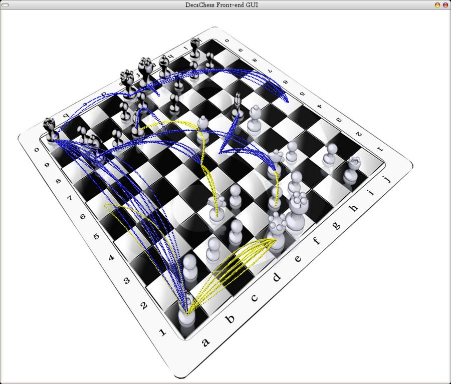

# What is Decachess?

It is a 10x10 chess variant with all the pieces set on the center 8 columns on
the furthest rows from the center.

It is built on top of the original Sjeng 8x8 chess engine.

Technically, Sjeng-10x10 is a highly advanced alpha-beta searcher, using modern
techniques like history and killer moves, transposition tables, SEE move
ordering and pruning, and search enhancements like selective extensions,
Aspiration Principal Variation Search, Adaptive nullmove pruning,
Extended Futility Pruning and Limited Razoring. Sjeng can use an
opening book and learns from the games it plays. 

# How do I get it to work?

Do not expect this to be easy. It was working at one point on Linux and OSX
but it got rusty. There will be some effort to modernise the libraries.

# Building it

## GNU/Linux, FreeBSD, other Unix variants:

Building Sjeng-10x10 should one day be as simple as:

    ./configure
    make
    (su to root if needed)
    make install
 
If you notice Sjeng is only reporting time in full second increments, edit
config.h and change `#define HAVE_FTIME` into `#undef HAVE_FTIME`.

## Windows, Etc

Probably not soon, but perhaps one day under Cygwin, etc.

 
# The opening books

Sjeng-10x10 uses two kind of books: .opn books and binary books

The .opn books are intended to be created manually, and are ideal for getting
Sjeng to play your favorite openings.  Some examples are in the books
directory. 

To use a .opn book, just copy it to the same directory where you are running
Sjeng from. Sjeng will always look in the .opn book first and will never apply
learning to it.

The binary books are created automatically from PGN databases, by a built-in
bookbuilder.

To use it, just start Sjeng and enter 'book'. To generate a
crazyhouse/bughouse book, first type 'variant crazyhouse', then type 'book'.
('losers' and 'suicide' are also supported) Be sure to make the keycache large
enough or the book-generation will be slow and you will end up with very large
files. One byte in the keycache is enough for one position. The keycache is
stored in RAM, so do not make it bigger than the actual amount of RAM you
have.

You need about 12 bytes diskspace per position that will be stored.

You must use a pure PGN database. PGN derivates like BPGN are not (yet)
supported, nor is the psuedo-PGN that some other programs output. 

I recommend running your PGN database through the 'Extract' program by David
Barnes first. It has options to strip variantions, comments and NAG's and to
suppress duplicates which will significantly speed up the bookbuilding
process, as well as getting rid of any psuedo-SAN.

A PGN database of some high-quality crazyhouse games is available at 
ftp://sjeng.sourceforge.net/pub/sjeng/zhbook.pgn

# Getting an interface

You can start Sjeng now by typing 'sjeng', but you will probably find the
text-based interface unpleasant.

# Generating endgame databases

Sjeng support endgame databases for the suicide
variant. You can generate them as follows:

1) Make a subdirectory named 'stb' in Sjeng's directory
2) Start Sjeng form the command line and issue the command 'buildegtb'

This will take an hour or so, depending on the speed of your computer.

# Tuning Sjeng
 
A great deal Sjeng's workings can be customized without recompiling it. You
should take a look at sjeng.rc and adjust the parameters to your likings.
Especially the first three are imporant because they control how much memory
Sjeng will use for transposition tables and caches.  If those are set too big
for your RAM, Sjeng will crash.

# Copying/Distribution

Sjeng is Free Software and is licensed under the GNU General Public License.
For more details see the file COPYING that comes with Sjeng. 

If this file is missing, write to the Free Software Foundation, Inc., 59 Temple
Place, Suite 330, Boston, MA  02111-1307  USA

Sjeng should have come with source code, or you should have been given the
possibility to obtain it for a charge no more than the cost of physically
performing the source distribution.  If not, please contact gcp@sjeng.org.

Sjeng includes tablebase accessing code written by Andrew Kadatch and Eugene
Nalimov. This code is contained in the files tbindex.cpp and tbdecode.h and is
copyrighted by them, all rights reserved.  This code does _not_ fall under the
GPL. You are hereby given the additional right to compile and link Sjeng with
this code, as well as to distribute the resulting executable and code under the
conditions of the GPL, except for the files tbindex.cpp and tbdecode.h, which
do not fall under the GPL, but may also be distributed together with Sjeng.

The author regrets having to include this non-free code with Sjeng, but no free
replacement of the same quality is availble yet.

